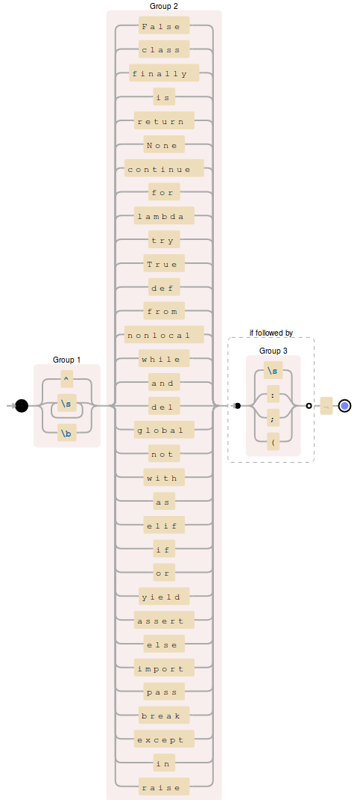
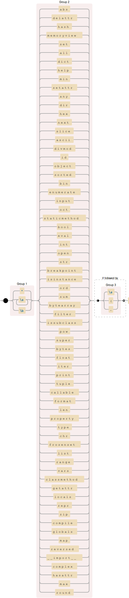
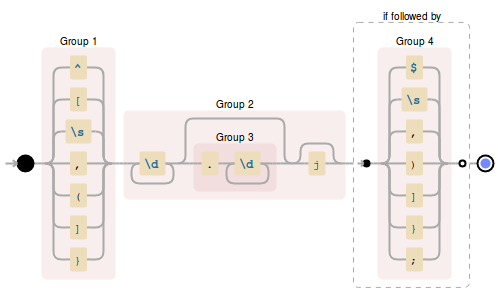
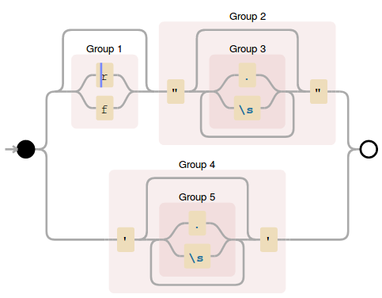
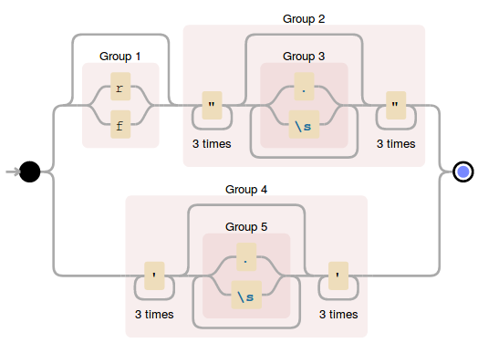
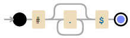
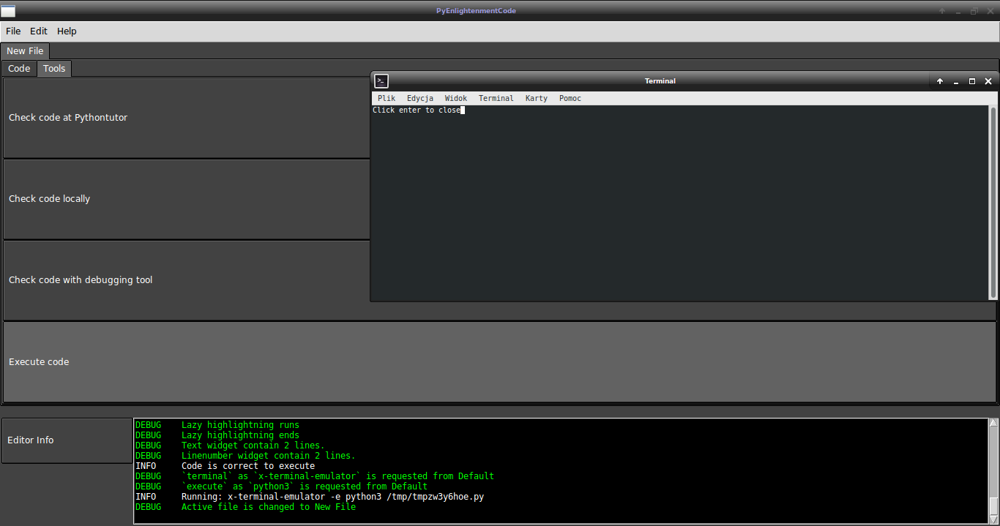

############################################
Uniwersytet im. Jana Długosza w Częstochowie
############################################

Praca Inżynierska
=================

Temat: Edytor do nauki programowania w języku Python
====================================================

Imię i nazwisko autora: Maciej Pawłowski
^^^^^^^^^^^^^^^^^^^^^^^^^^^^^^^^^^^^^^^^
Kierunek studiów: Informatyka
^^^^^^^^^^^^^^^^^^^^^^^^^^^^^
Specjalizacja: Inżynieria Oprogramowania
^^^^^^^^^^^^^^^^^^^^^^^^^^^^^^^^^^^^^^^^

Opiekun pracy: dr. Lidia Stępień
^^^^^^^^^^^^^^^^^^^^^^^^^^^^^^^^

Częstochowa, rok akademicki 2019/2020

Spis treści
###########

#. **Wstęp**
#. **Cel i założenia projektu**
    #. Wymagania sprzętowe
    #. Wymagania funkcjonalne
    #. Podstawy użytkowania
#. **Implementacja**
	#. Biblioteki
	#. Struktura
    #. Opis aplikacji
    #. Edytor PyEnlightmentCode
    #. Kolorowanie składni
    #. Narzędzia debugujące
#. **Testy**
    #. Testy wyrażeń regularnych
    #. Testy zarządzania plikami
#. **Podstumowanie**
#. **Bibliografia i literatura**

1. Wstęp
########

Rozwój i popularyzacja komputerów sprawiły że niemalże w każdej dziedzinie odpowiednie maszyny są w stanie zastąpić człowieka dopóki zadane zagadnienie jest problemem przeliczalnym.
Ponadto czas pracy maszyny jest o wiele tańszy niż czas pracy programisty który raz wykonując swoją pracę, może zaoszczędzić setki a nawet tysiące godzin pracy ludzkiej.

Jest to o tyle popularną praktyką aby część pracy ludzkiej przenosić na maszyny, że niektóre firmy specjalizują się wyłącznie w tym kierunku. Potrzeba programistów na rynku wciąż rośnie proporcjonalnie do rozmiarów aplikacji które posiadają coraz większe funkcjonalności.

Aby wykształcić nowych programistów istnieje wiele metod mniej lub bardziej skutecznych. Natomiast dobry programista powinien bezbłednie rozumieć podstawy programowania, potrafić zdebugować kod rozumiejąc co się dzieje na każdym kroku, znaleźć błąd i go naprawić. W tym celu powstał PyEnlightenmentCode (dalej PEC) który skupia się na dostarczeniu narzędzi ułatwiających naukę dla nowych programistów.

1.1 Wymagania sprzętowe
#######################

PyEnlightenmentCode do działania w pełni poprawnie wymaga:

* Środowiska z rodziny systemów Unix 64 bit (Linux)
* Klawiatury, Myszy oraz monitora
* Przeglądarkę internetową wspieraną przez pythontutor.com
* Połączenie z internetem
* Python3 (Interpreter)
* pip3 (Installer pakietów)
* pdb (Debugger)

1.2 Wymagania funkcjonalne
##########################

PyEnlightenmentCode (dalej PEC) spełnia poniżej wymienione wymagania funkcjonalne:

* Edytor tekstu.

Edytor tekstu zawiera w sobie mechanizm kolorujący składnię języka programowania Python z użyciem wyrażeń regularnych.

* Menadżer plików.

PEC umożliwia otwarcie wielu plików, przełączanie się pomiędzy nimi, zapis pojedyńczego pliku, zapis wielu plików, nadpisanie pliku, wczytanie pliku, stworzenie nowego pliku.

* Konsola informująca.

PEC posiada dolny panel który informuje użytkownika o czynnościach które podjął, ostrzeżeniach o potencjalnym niepoprawnym użytkowaniu programu, błędach dla podjętych czynności.

* Narzędzia debugujące.

PEC daje kilka możliwości które mają na celu ułatwienie zrozumienia kodu dla potencjalnego przyszłego programisty. Są one dostępne dla każdego pliku z osobna w zakładce Tools:

Otworzenie zewnętrznego portalu pythontutor.com w domyślnej przeglądarce przekazując kod w postaci url. Portal umożliwia prześledzenie wykonywania programów do 999 kroków z wizualizacją wartości zmiennych.

Sprawdzenie kodu lokalnie pod względem błędów składniowych, takich jak: SyntaxError, NameError i RuntimeError

Zapisanie kodu w pliku tymczasowym i uruchomienie debuggera, plik tymczasowy po zakońćzeniu działania debuggera zostanie usunięty.

Zapisanie kodu w pliku tymczasowym i uruchomienie go.

* Zapisywanie konfiguracji.

Gdy edytor zostanie zamknięty poprawnie, zostanie zapisana lokalizacja i umiejscowienie okna, jeśli krawędź programu miałaby na skutek błędu z rodzielczością znaleźć się poza zasięgiem myszy, program powinien przy ponownym uruchomieniu zostać przyciągnięty do krawędzi ekranu i ewentualnie zmniejszony do rozmiaru ekranu jeśli ten byłby większy niż rozdzielczość ekranu.

* Pasek menu

Pasek menu umożliwia zarządzanie plikami jak wyżej wymieniono.

1.3 Podstawy użytkowania
########################

Aby skorzystać z edytora wystarczy uruchomić dostarczony plik binarny. Zalecane jednak jest umieścić plik binarny w lokalizacji /usr/bin z uprawnieniami do wykonywania przez aktualnego użytkownika. Wtedy staje się dostępny z poziomu konsoli i potencjalnych dowiązań (ikon szybkiego dostępu / skrótów). 

2. Implementacja
################

2.1 Biblioteki
##############

Do implementacji zostały wykorzystane następujące pakiety wraz z używaną funkcjonalnością:

* tkinter

Podstawowa bibliteka odpowiedzialna za GUI

* ttk

Dodatkowo rozbudowane widżety rozwijane przez społeczność tkintera.

* ttkthemes

Wcześniej zdefiniowane style dla widżetów tkinter i ttk.

* typing

Typowanie zmiennych wewnątrz projektu w celu ułatwienia wdrożenia, debugowania i rozwijania.

* logging

Singleton odpowiedzialny za komunikację programu z użytkownikiem i developerem.

* os, sys

Biblioteki systemowe do zarządzania ścieżkami, tworzenie struktury ustawień domyślnych i zarządzanie plikami.

* subprocess

Uruchamianie procesów potomnych na potrzeby debugowania lokalnego bądź uruchomienia programu z poziomu edytora.

* threading

Uruchamianie oddzielnych wątków zapobiegając zmrożeniu jednowątkowego edytora.

* json

Zarządzanie, zapis i odczyt ustawień.

* webbrowser

Uruchamianie domyślnej przeglądarki na konkretnej stronie.

* urllib

Przetwarzanie kodu na url do odczytu dla zewnętrznego portalu.

* tempfile

Zarządzanie plikami tymczasowymi.

Wszystkie są dostępne w standardowej biblitece pythona, bądź w ramach pakietów dostępnych porzez pip3.

2.2 Struktura
#############

Na implementację PyEnlightenmentCode składa się wiele klas, które zapewniają strukturyzację kodu:

* **MainWindow:** Wzorzec Singleton i Obserwator

    `'PyEnligtenmentCode/main_frame.py'`

Trzon aplikacji odpowiadający za stworzenie głównego okna i zarządzanie poszczególnymi menadżerami które zostaną wypisane poniżej.

* **MainFrameErrorCatcher:** Menadżer błędów

    `'PyEnligtenmentCode/main_frame.py'`

Opakowanie (ang. Wrapper) przechwytywanych błędów i przekierowanie ich do konsoli informującej użytkownika o błędach w trakcie wykonywania programu, przekazuje je do modułu logging który jest singletonem dostępnym z każdego miejsca w programie.

* **Default:** Menadżer konfiguracji

    `'PyEnligtenmentCode/defaults/tkhelper.py'`

Jest to struktura słownikowa która zawiera całą informację o konfiguracji PEC. Umożliwia odczytanie i zapis konfiguracji do pliku `'~/.config/PyEnlightmentCode/config.json'` oraz zmianę parametrów. 

* **MenuBar:** Menadżer paska menu, górny panel.

    `'PyEnligtenmentCode/components/menu_frame.py'`

Menadżer konfiguruje menu i komendy przypisane pod konkretne opcje z rozwijanego menu, komunikując MenuBar z MainWindow.

* **BottomPanel:** Menadżer konsoli informującej, dolny panel.

    `'PyEnligtenmentCode/components/bottom_frame.py'`

Menadżer konfiguruje lokalizację klasy `'TextHandler'` i przypisuje modułowi logging jako miejsce wyświetlania komunikatów dla użytkownika.

    * **TextHandler:** Widżet konsoli informacyjnej

        `'PyEnligtenmentCode/components/bottom_frame.py'`

    Wczytuje z Default kolor komunikatów zależny od poziomu komunikatu, wyróżnia się tutaj 6 typów komunikatów, kolejno:
    `"CRITICAL", "ERROR", "WARNING", "INFO", "DEBUG", "NOTSET"`

        * Critical - uniemożliwia dalsze działanie aplikacji.
        * Error - podczas wykonywania instrukcji edytor napotkał błąd i nie może jej wykonać.
        * Warning - ostrzeżenie przed wykonaniem czynności która może odnieść nieoczekiwany skutek.
        * Info - informacja dla użytkownika.
        * Debug - domyślnie nie wyświetlane dla użytkownika, ma za zadanie przekazać pełną informację co się dzieje w programie, są to komunikaty typowo dla developera.
        * Notset - domyślnie nie wyświetlane dla użytkownika i developera. Zawiera komunikaty bezpośrednio z samego modułu logging.

    Przed emisją komunikatu oznacza wiadomość odpowiednim tagiem pozwalając na zastosowanie odpowiedniego koloru dla danego poziomu komunikatu. Konkretne ustawienie poziomu modułu `'logging'` zawiera wszystkie wyższego poziomu, domyślne ustawienie dla użytkownika to `'INFO'` które zawiera również powyższe dla niego: `'Critical', 'Error' i 'Warning'`

* **EditorManager:** Menadżer plików.

    `'PyEnligtenmentCode/components/file_frame.py'`

Umożliwia zarządzanie plikami, przełączanie się pomiędzy nimi, wytypowanie aktywnego pliku do kolorowania składni. Plikami zarządza z pomocą Menadżera pliku `'FileContent'`. Zamknąć konkretną zakładkę można klikajac środkowym przyciskiem myszy (z reguły kółkiem myszy).

    * **FileContent:** Menadżer pliku.

        `'PyEnligtenmentCode/components/file_frame.py'`

    Przechowuje informacje o pliku takie jak nazwa i ścieżka, tworzy zakładki dla widżetów `'ProgrammingText'` jako `'Code'` oraz `'ExecutionTools'` jako `'Tools'`. Przy wyświetlaniu (Na przykład przy zmianie z innego pliku na ten) konkretnego pliku oznacza jego treść do kolorowania składni.
    
    * **ProgrammingText:** Multi-widżet opakowujący trzy widżety.
        
        `'PyEnligtenmentCode/components/editor_programming_text.py'`

	Konfiguruje trzy widżety, pole tekstowe dla kodu `'TkHighlightningText'`, pole tekstowe dla numerów linii `'tk.Text'` oraz pasek przewijania `'tk.Scrollbar'` zsynchronizowany dla obu pól tekstowych. Statycznie oznacza aktywne pole tekstowe z kodem, definiuje działanie zmiany aktywnego pola tekstowego, aktualizacji numerów linii oraz podświetlania składni tekstu.

	* **TkHighlightningText:** Widżet opakowujący tk.Text
        
        `'PyEnligtenmentCode/components/editor_programming_text.py'`

	Dodaje metodę odpowiedzialną za wyszukiwanie i kolorowanie składni pythona. 
	
	* **ExecutionTools:** Widżet pośredni, opakowujący tk.Frame
        
        `'PyEnligtenmentCode/components/editor_execution_tools.py'`
	
	Konfiguruje blok `'TkCodeExecutors'` oraz oznacza aktywny blok aby poprawnie wybrać kod do używanych narzędzi debugujących.
	
	* **TkCodeExecutors:** Widżet opakowujący tk.Frame
        
        `'PyEnligtenmentCode/components/editor_execution_tools.py'`
        
	Tworzy przyciski `'ttk.Button'` które umożliwiają wcześniej wymienione akcje debugowania kodu. 

* **TkHelper:** Menadżer tkintera

    `'PyEnligtenmentCode/defaults/tkhelper.py'`

Zbiór metod statycznych które odpowiadają za konfigurację okna, widżetów i kolorowanie składni. Odseparowanie ich upraszcza kod samego graficznego interfejsu oraz separuje działania mogące spowodować błąd od klas które w wyniku błędu mogłyby zaprzestać swojego działania.

2.3 Opis aplikacji
##################

Aplikacja posiada plik wykonywalny umożliwiający jej otworzenie, natomiast brak spełnionych zależności nie zapewnia pełnej funkcjonalności przewidzianej dla edytora. W pliku wykonywalnym zaszyte są takie zależności jak dane niezbędne do uruchomienia się samodzielnie na potrzebę edycji tekstu, otworzenia przeglądarki i skonstruowania url dla portalu pythontutor oraz sprawdzenia kodu pod kątem błędów składniowych (niezależnie od tego czy interpreter pythona jest zainstalowany).

W celu pomocy przy rozwoju oprogramowania, dołączone zostają dwa skrypty `'make_binary.py'` i `'dev_dependencies.py'`. Pierwszy umożliwia z podstawową wiedzą kompilację źródeł w plik wykonywalny. Drugi instaluje niezbędne pakiety dla developera aby umożliwić debugowanie offline.

2.4 Edytor PyEnlightmentCode
############################

Kod jest otwartoźródłowy, do znalezienia pod adresem: https://github.com/GuazP/PyEnlightenmentCode
Ostatnia stabilna wersja pliku wykonywalnego znajduje się w podfolderze `'PyEnlightenmentCode/binary'` pod nazwą PyEnlightmentCode.

2.5 Kolorwanie składni
######################

Na kolorowanie składni w edytorze PyEnlightmentCode składa się szereg wyrażeń regularnych:

* Słowa kluczowe:

Wyrażenie:
`(^|\\s)?(False|class|finally|is|return|None|continue|for|lambda|try|True|def|from|nonlocal|while|and|del|global|not|with|as|elif|if|or|yield|assert|else|import|pass|break|except|in|raise)(?=(\\s|:|;|\\()))`

Graficzna reprezentacja *'www.debugexx.com'*:

* Funkcje wbudowane:

Wyrażenie: `(\\s)+(abs|delattr|hash|memoryview|set|all|dict|help|min|setattr|any|dir|hex|next|slice|ascii|divmod|id|object|sorted|bin|enumerate|input|oct|staticmethod|bool|eval|int|open|str|breakpoint|isinstance|ord|sum|bytearray|filter|issubclass|pow|super|bytes|float|iter|print|tuple|callable|format|len|property|type|chr|frozenset|list|range|vars|classmethod|getattr|locals|repr|zip|compile|globals|map|reversed|__import__|complex|hasattr|max|round)(?=(\\s|\\(|\\.)))`

Graficzna reprezentacja *'www.debugexx.com'*:

  
* Typy numeryczne:

Wyrażenie: `(^|\[|\s|,|\(|\]|\})(\d+(\.\d+)?j?)(?=($|\s|,|\)|\]|}|;))`

Graficzna reprezentacja *'www.debugexx.com'*:

  
* Łańcuchy znaków:

Wyrażenie: `(r|f)?(\"(.|\s)*\")|(\'(.|\s)*\')`

Graficzna reprezentacja *'www.debugexx.com'*:

* Łańcuchy wielo-liniowe / Dokumentacyjne:

Wyrażenie: `(r|f)?(\"{3}(.|\s)*\"{3})|(\'{3}(.|\s)*\'{3})`

Graficzna reprezentacja *'www.debugexx.com'*:

* Komentarze kodu:

Wyrażenie: `#.*$`

Graficzna reprezentacja *'www.debugexx.com'*:

Wyrażenia regularne są zoptymalizowane pod wyszukiwanie wyrażeniami regularnymi wewnątrz struktur tkintera który posiada do tego wbudowany mechanizm. W przyszłości implementując własny mechanizm jest możliwe wykonanie tego lepiej.

Tagi kolorujące składnie są usuwane z pola tekstowego po przełączeniu na inny plik w celu optymalizacji zajmowanej przez program pamięci, podczas wyboru pliku zostaje pod względem podświetlania składni przeszukany cały aktualny plik tekstowy. W trakcie pisania kodu, po postawieniu każdego znaku ponownie jest uruchamiane kolorowanie składni, tym razem obejmując tylko trzy linie powyżej, aktualną i do trzech linii poniżej o ile istnieją.

2.6 Narzędzia debugujące
########################

1. `'Check code at Pythontutor'`

Konwertuje kod na parametr typu GET dla url pythontutor.com i uruchamia połączony url w domyślnej przeglądarce.

2. `'Check code locally'` 

Sprawdza kod pod względem błędów składniowych

3. `'Check code with debugging tool'`

Uruchamia narzędzie do debugowania kodu pdb. Nawigacja po pdb według standardów w dokumentacji pdb.

4. `'Execute code'`

Uruchamia kod w nowym terminalu.

3. Testy
########

3.1 Testy wyrażeń regularnych
#############################

-ToDo-

3.2 Testy zarządzania plikami
#############################

-ToDo-

4. Podsumowanie
###############

Edytor spełnia swoje założenie pomagając w wizualizacji kodu. Dzięki tej aplikacji nowi programiści używając jej będą mieć dokładną wizualizację co dzieje się w napisanym przez nich programie. Powinno to zminimalizować ryzyko innej interpretacji co dzieje się podczas podstawowych operacji jak działania na listach i przyspieszyć naukę dzięki możliwości szybszego przejścia do kolejnych ćwiczeń z solidną informacją zarówno w postaci kodu jak i wizualnej.

5. Bibliografia, literatura i narzędzia
#######################################

Dokumentacja pythona i bibliotek: https://docs.python.org/3/

Wizualizacja wyrażeń regularnych: www.debuggex.com